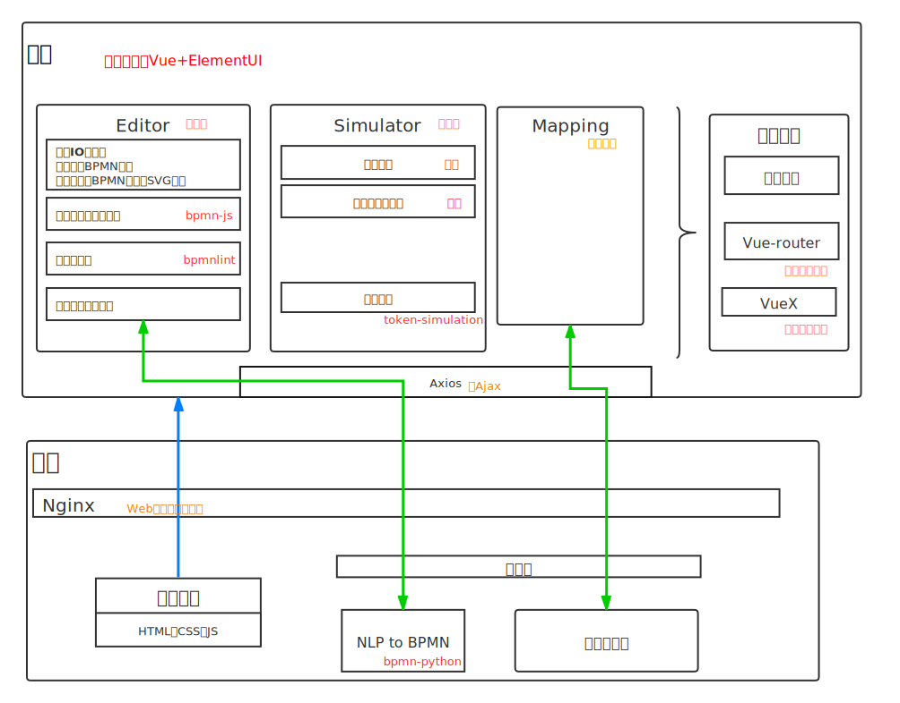
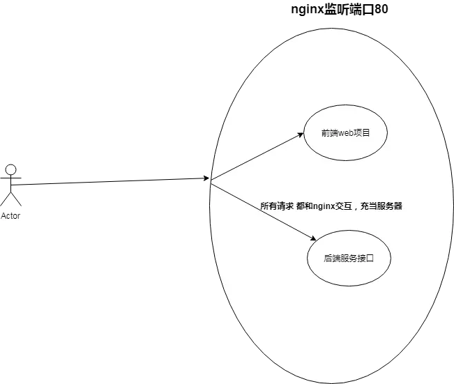

至此，上学期找的所有现成的东西都已经集成到里面了


## 存在的问题：

### 自然语言处理模块效果不太好

```
test1:
Sometimes, we buy details for cold calls, sometimes, our marketing staff participates in exhibitions and sometimes, you just happen to know somebody, who is interested in the product.

test2:
Open the box and take out the ball.

test3:
If the storehouse has successfully reserved or backordered every item of the part list and the preparation activity has finished

```


### 跨域问题

浏览器同源策略：是指协议，域名，端口都要相同，其中有一个不同都会产生跨域；


实际上的解决办法

